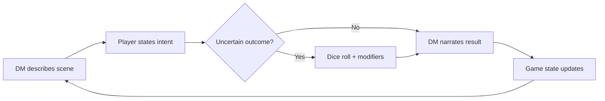
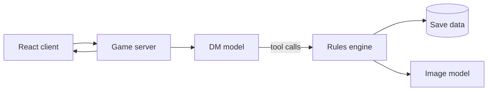

# AI Dungeon Master RPG — Design Doc

> Snapshot of the living design doc (last edited 2026-09-24): https://claude.ai/artifact/LyhpJHmiXdVHNKtzoRUib4
> The living doc is the source of truth. If they disagree, ask before building.

## Vision and pillars

A single-player RPG where an LLM Dungeon Master improvises the story and rules on anything you try, like a great human DM at a real table. Creativity and roleplay come first; combat is one tool among many, not the core.

1. **Anything you say is a valid move.** The player types intent in plain language. The DM never answers "you can't do that"; it answers "roll for it" or "here's what happens."
2. **The world remembers.** If you wear bread as a hat, NPCs notice it three scenes later. Consequences persist because code stores them, not because the model happens to recall them.
3. **Rulings feel fair.** Dice and stats decide outcomes the player can see. The DM narrates; it doesn't secretly decide who wins.
4. **Browsable structure around a freeform core.** Menus for spells, skills and gear give the satisfying progression of a CRPG without limiting what you can attempt.
5. **Every scene can be seen.** Generated art makes moments feel real, from a portrait of your character to a wall collapsing onto enemies.

Out of scope for v1: multiplayer, tactical grid combat, voice, and a fixed hand-authored campaign.

## Core loop

Each turn is a short exchange: the DM sets the scene, the player states intent, dice decide when the outcome is uncertain, and the world updates.

The loop repeats inside a larger session arc: arrive somewhere, discover a problem, pursue it creatively, resolve it, rest and level up. A satisfying session is 20–40 minutes, so it fits a commute or a flight.

The player can step out of the loop at any time to open the character sheet, spell book or inventory. Those menus never advance time.

## The AI Dungeon Master

The DM is an LLM with a strong persona prompt and a fixed set of tools. It narrates and proposes; the game engine validates and applies.

**What it does each turn**

- Reads the current scene, relevant character state and recent history.
- Decides whether the player's intent needs a roll, and sets a difficulty (easy 8, medium 12, hard 16, heroic 20).
- Narrates the outcome in 2–5 sentences, in second person.
- Calls tools to change the world, then offers an open prompt, never a multiple-choice list.

**Judgement calls it should make**

- Creative actions get a bonus, not a penalty. Collapsing a wall onto enemies is a clever ruling, not a rules violation.
- Silly choices stick. Bread worn as a hat becomes an item with tags like `edible` and `ridiculous`, and NPCs react to it.
- Failure moves the story forward. A failed lockpick means guards arrive, not a dead end.
- It says no only to things that break the fiction, like teleporting to the moon at level 1, and explains why in character.

**Tools it can call**

| Tool | What it does |
|---|---|
| `roll_check` | Rolls d20 + modifier against a difficulty; the engine rolls, never the model |
| `update_character` | Changes HP, conditions, XP |
| `add_item` / `remove_item` | Edits inventory, with free-form tags |
| `set_flag` | Records world facts ("mayor owes you a favour") |
| `spawn_npc` / `update_npc` | Creates or changes a named character and their attitude |
| `move_scene` | Changes location and generates its description |
| `generate_image` | Requests scene art or a portrait with a style prompt |

**Tone**: warm, witty and descriptive, like a DM who enjoys the players. Content stays PG-13 by default.

## Game state and rules

Code owns the truth; the LLM only proposes changes through tools. This keeps rulings consistent and stops the world from drifting as conversations get long.

| Owned by code | Proposed by the LLM |
|---|---|
| Dice results, HP, XP, level | Whether a roll is needed, and its difficulty |
| Inventory and item tags | New items and what they're called |
| World flags and NPC attitudes | What those flags and attitudes mean in the story |
| Current scene and location graph | Scene descriptions and new locations |

**Resolution system**: a light d20 system in the spirit of D&D 3.5, but stripped of its modifier bookkeeping. Six stats (Might, Agility, Wits, Presence, Spirit, Luck) each give a modifier from −2 to +4. A check is d20 + stat modifier + situational bonus against a difficulty.

**Memory**: the DM gets a compact state summary every turn, not the full transcript. A rolling "story so far" summary is rewritten every ~10 turns and saved with the game.

**Guardrails**: the engine rejects impossible tool calls, like removing an item the player doesn't have, and tells the DM so it can re-narrate.

## Character and progression

The character is the heart of the game. Think of it like importing a person's memory into a new account: a backstory document the DM reads every scene, plus structured fields (stats, skills, traits) that grow alongside it. Play writes new entries to both, so who you become and what you can do grow together.

**Don't front-load the build.** A new player hasn't earned the investment yet, so character creation is light: a name, a one-line concept, a starting stat spread. The depth arrives through leveling, when the story has its hooks in and you actually want to sit with the books and craft. Level-up is the reward you look forward to, not a chore at the start.

### The four layers

Every moment the DM narrates reads from four layers at once:

1. **Stats** — who you fundamentally are (Might, Agility, Wits, Presence, Spirit, Luck). Broad and physical. They set what the world *assumes* about you before any roll: a 17-Might character gets asked to lift the fallen horse; a clumsy one trips over the log and sprains an ankle. Stats color the ambient narration constantly, quietly, even when nothing is rolled.
2. **Skills** — what you specifically trained (a fixed, browsable list you spend points on each level). Narrow and earned. Skills let a character punch above their stats: a weak character who invested in hand-to-hand feels like a god for one bar fight. They also unlock whole solution paths — a woodworking skill turns being stranded on an island into building a ship.
3. **Traits** — the spice the world grants you. Special abilities, often double-edged, sometimes tailored to your story by the DM. You can choose one at level-up, or find one riding along with an item or a quest reward. This is where controlled chaos lives.
4. **Dice** — the uncertainty over all of it. The big swings: persuade a dragon to burn down a rival brewery on a nat 20, or fail so magnificently on a crit that the failure becomes the story.

### Two ways stats and skills act

- **As reputation (no roll):** stats and skills set the DM's baseline for how NPCs and the world treat you by default. They shape the narration even when nothing is uncertain.
- **As dice modifiers (a roll):** when an outcome is in doubt, the same numbers feed the check. Dice handle "will this risky thing work"; the reputation layer handles "how does the world see me."

### Traits: chaos and character

Borrow the double-edged design from Starfield (the parents who love you but want rent; the buff in one setting that's a debuff in another) — the price is what makes a build feel alive. But reject its front-loading: you shouldn't commit to a playstyle before you've played. Borrow the drip-feed from Skyrim (a new toy to try every single level, always something to look forward to), but reject rigid perk trees in favor of a broad flat skill list plus emergent, DM-granted traits. Tailoring a trait to the story's balance is exactly the judgment call an AI DM can make and a scripted game can't.

### Backstory as living memory

The backstory isn't a paragraph read once and forgotten. It's a first-class document the DM references every scene, and it updates as you play — both your qualitative growth (recent actions, personal change) and your quantitative growth (stats, skills, traits) live in the same character state. The drunkard cleric from a sect of beer-brewing monks gets welcomed as a brother in one temple and eyed sideways in another, because the world knows who you chose to be.

### Menus and controls

- Character sheet: stats, HP, conditions, traits, portrait
- Spell book and skill list: learned and learnable, with search
- Inventory: items with their tags visible, so the bread hat is a real object
- Journal: auto-written quest log and NPC list
- Level-up screen: spend skill points, pick a trait, raise a stat — with an auto-assign option so the storyteller can click continue while the min-maxer pores over the choices

## Consequences of failure

The guiding principle: nothing without consequence. Every failed encounter writes something into the world or the character. Death is not a binary and not a rewind — it is the bottom rung of a ladder of loss, and the DM chooses the rung that fits the stakes of the moment.

**The ladder, softest to hardest**

1. **Flee.** Sometimes the smart read. No dishonor, but still a cost: ground given up, a chance missed, the danger still waiting.
2. **Non-death defeat.** You lose but the story spares you into something worse than a clean death — captured, enslaved, sold to the goblins. Escape becomes the next quest; you keep playing from the bottom of a hole.
3. **Maiming.** You survive but marked: a lost limb, a permanent hit to a stat. This feeds the trait system — a hook for a hand, a sword strapped to the stump. The scar becomes a build, and creative recovery turns loss into character.
4. **Death.** Not a rewind. The world moved on without you, in the shape of your failure (see below).

**Death as a time skip with consequences**

When you truly die, the world does not politely wait. You get an epilogue — witnessing your own wake, seeing which companions fell and which carried on — which gives the arc emotional weight and closure. Then you return later (resurrected, dragged back, awakened), and you inherit the wreckage of your failure: the conqueror now rules, the city has fallen, companions are dead or scattered. You keep who you are — your growth, your scars — but you lose the world you were trying to save and pick up a new arc in its rubble. Only an LLM DM over a persistent, code-owned world can improvise "what the world becomes if you lose here."

**The epilogue scales with investment.** Its length and cast depend on how long you've played and what you've done. Die to a bear in the first five minutes and you get a wry tombstone ("Here lies Sir John the Second, victim of an ill-fated encounter with a bear") and the urban legend of the fool who fought it. Die eighty hours in and the epilogue earns its length: companions speak at your wake, factions react, loose threads resolve. Early recklessness should be fun to watch fail, not a pretend tragedy.

**Scale of consequences**: the size of the aftermath must match the fight. Losing a small skirmish skips days; losing a world-defining battle reshapes the world. Otherwise every death becomes an epic and loses its edge.

**Two exits from death: continuation and renewal.**

- **Continuation is the default.** You return to the same world and inherit the wreckage of your failure. This is the path players are held to.
- **Renewal is a DM-driven narrative choice, not a button.** The DM offers or requires a fresh start only when a story has genuinely ended: a true final death (dying during a death trial, or accumulated marks closing the door), an arc reaching real completion, or a death so total that continuing would feel contrived. A renewed character starts somewhere new in the same world and may carry a faint echo of the old one, like hearing their legend or finding their grave.
- **New game is separate and always available.** The pause menu always offers "New game," which starts a brand-new world. It's an out-of-fiction choice for the player, distinct from renewal, which happens inside the story.

You never start over because things got hard. You start over because a story ended, well or badly.

**Late-game safety nets, earned not given**: resurrection stones, scrolls, or a high-level party member's resurrection spell exist, but only deep in a campaign and only when hard-won. Early deaths must bite; veteran insurance is precious, hoarded, and agonizing to spend, and still carries a cost.

## Interaction and onboarding

**The text box is the steering wheel; suggestions are signposts.** You can drive anywhere by typing, but the game shows a few roads so you're never staring at a blank field. Free typing is the primary, front-and-center control; suggestions are the smaller sidekick, helpful when you're stuck.

**Suggestions are noticing-nudges, not action-buttons.** The failure mode is a menu like "Attack / Talk / Flee" — people just tap and creativity dies. Instead, suggestions point at things to notice: "the guard looks nervous," "there's a window behind him," "you still have that bread." They hint at possibility without scripting the action, so the typing instinct stays alive.

**Suggestions de-program the Zork instinct.** New players arrive expecting a guess-the-verb parser and will type timidly, probing for accepted commands. Early nudges that hint at things a parser could never handle — talk your way out, use the bread, collapse the wall — teach that the game understands intent, not commands.

**Onboarding goal: provoke a wild idea and reward it, fast.** The first ten minutes should bait the player into testing the boundaries, then show them there aren't any. The first time a player types something they *assumed* wouldn't work and the DM runs with it is the moment they stop playing Zork and start playing this game. That may be the single most important beat in the whole game.

**The opening is a tutorial disguised as a story.** Borrow the *shape* of Oblivion's prison-break start (take it directionally, not literally): a contained, low-stakes space with an obvious near-term goal, safe enough that fumbling is cheap, open enough to reward experimentation. Could be a shipwreck, a caravan, waking with amnesia in a stranger's care — the prison is the pattern, not the setting.

**Character definition through conversation.** In that opening, an NPC (the dark elf in the next cell) draws your identity out of you through dialogue — "where did you come from?" Your typed answer becomes your backstory. This is *how* we avoid front-loading the build: the world interviews you into existence instead of showing a stat screen. It teaches three things at once — your words have permanent weight, they seed the backstory-as-living-memory document, and talking *is* playing.

## World presentation and visuals

**The real goal: never feel like a B2B app.** The enemy to avoid isn't text or a chat structure — it's the feeling of using a productivity tool, of "playing Cursor as a game." It should feel like interacting with a story. The layout is still an open experiment, and this is a *feel* problem: it gets solved by building a few rough versions and living in them, not by arguing it on paper.

### The screen-real-estate constraint

The keyboard is the primary controller and eats 30–40% of the screen, and it should probably stay persistent. That leaves roughly half a screen to hold the latest narration, a sense of place, who's with you, and any visual content — all at once. A big pinned hero image doesn't fit that math. This is harder than it first looks; the honest approach is to prototype, not to declare an answer.

### Two dials, not a list of options

The design space is best understood as two independent knobs rather than a menu of layouts.

**Dial 1 — position on the transcript-to-book axis.** One spectrum runs from a chat transcript at one end to an illuminated book at the other:

- *Transcript end:* snappy, modern, widget-friendly; discrete rich objects (dice chips, item cards, portraits) flow by. Maps cleanly onto the tool-call architecture — each DM tool call has a natural visual home in the stream. Risk: feels like productivity software.
- *Book end:* beautifully typeset narrative as the primary texture, sparing illustrations so they stay special, mechanics rendered as tasteful visual punctuation woven into the prose (a dice roll set like a drop-cap flourish). Plays to typography strengths; photographs like a premium product.
- **The middle is the danger zone.** A bland, clean chat is exactly where it reads as software. The axis is not symmetric: the book end is safe, the far game-HUD end is safe, the middle is not.

**Dial 2 — how much the layout adapts per moment.** The DM already knows the scene, so the interface can reallocate screen to what the moment is *about*: text-dominant for quiet exploration and dialogue; a persistent widget growing for tactical combat, where positions and party health matter, shrinking the text to a blow-by-blow ticker. Combat is a state the engine tracks, so the layout can respond automatically. Transitions should grow *in* smoothly, never slam into a different-app feel.

### Two escape routes from the B2B feeling

Both solve the same problem with opposite aesthetic moves:

- **Upward into literature:** the illuminated book — a nice edition of Lord of the Rings with dice rolls thrown in. Mechanics as tasteful marginalia. Runs away from HUD conventions entirely.
- **Sideways into game-craft:** lean into RPG heritage — real health and mana bars, party portraits with status, honest video-game visual grammar, nothing resembling a settings panel.

Cheesy-or-magic is entirely a craft-of-presentation question (typography, motion, art, sound), not a structure question.

### Non-negotiable: a minimal vitals HUD

D&D-style play needs legible vitals at a glance — health, mana, and party status. Even the most literary version can't be pure prose; it needs a minimal, persistent status display for the numbers that matter moment to moment. Both escape routes converge on needing always-visible status furniture — they just dress it differently (marginalia vs. RPG bars).

### Candidate directions to prototype

1. **Breathe-when-keyboard-drops:** text-dominant while typing (tiny persistent location/party strip); the illustration expands when the keyboard is dismissed. Follows the compose-vs-witness rhythm.
2. **Stream-as-canvas:** the whole game is a rich vertical stream; each tool call renders inline (dice chip, item card, illustration, pinned NPC portrait). History scrolls, status stays. Must escape *feeling* like Slack through craft.
3. **Adaptive hybrid:** the stream by default, with persistent widgets that grow for combat and other spatial moments. Likely where it lands — the two dials combined.

**Aesthetic option: Undertale meets the terminal.** One direction among several. Keep the structure text- and book-heavy, but dress it in a retro text-adventure look: monospace or pixel type, terminal-flavored narration, chunky pixel sprites and portraits in the Undertale vein. Why it's interesting: it's a third escape route from the B2B feeling, into nostalgic game-craft rather than literature or a modern RPG HUD; pixel art is cheap and consistent to generate; and it plays with the Zork expectation on purpose, since the game *looks* like a parser and then understands anything you type, which makes that first wild-idea reveal land harder. The tension to watch: a bare terminal look sits close to "playing Cursor as a game." Undertale's warmth, character, and sprites are what keep it on the game side of that line.

Leaning toward the book-ward end of Dial 1 (beautiful typeset narrative, sparing images, dice-and-loot as visual punctuation), with the layout adapting for combat.

**Considered and deprioritized:** map-first (personal preference against exploring via a map); card-based (pulls away from free typing, the core). Voice-and-audio-forward is a *channel* to layer on later (eyes-free play), not a base layout.

**Generated art across all directions:** portraits at character creation and when appearance changes (bread hat included); one illustration per new location plus "moment" images for dramatic rulings; a single locked style prompt for consistency; images cached per scene so revisiting costs nothing.

## Technical architecture

A TypeScript web app with a thin server that holds API keys and runs the DM loop. Every change deploys to a preview link you can playtest on a phone.

| Layer | Choice | Why |
|---|---|---|
| Client | React + TypeScript | Close to your React Native skills |
| Server | Node API routes | Keeps keys off the client |
| DM model | Claude via API, swappable | Tool use is the core mechanic |
| Rules engine | Plain TypeScript, unit-tested | Deterministic and easy for agents to test |
| Saves | JSON per game in a small database | Simple to inspect and debug |
| Images | An image-generation API behind one tool | Provider can change without touching the DM |
| Hosting | Preview deploys per pull request | Playtest from anywhere |

The DM model sits behind one interface, so Grok or another model can be tried as DM later without changing the engine.

## World and tone

**Traditional high fantasy as the base.** Familiar enough that players can walk in instantly — elves, taverns, dungeons — which also serves onboarding, since people already know the rules of the fiction.

**A single coherent, recurring world.** Real geography, named powers, and enough history to have a status quo worth toppling. This is what makes the death system land — losing to a named power actually reshapes something. Each playthrough can drop you into a different corner of the same world.

**Sincere world, player-tuned comedy.** The setting and its NPCs play it earnest, with a baseline of light comedy always simmering. The comedy emerges from the collision between an earnest world and a player doing something ridiculous — the bread hat is only funny because the guards react seriously. The level of absurdity is set by the player, just like at a real D&D table, and the DM mirrors it: straight if they're straight, gonzo if they push it. One game welcomes both the earnest storyteller and the chaos gremlin.

**One strong distinctive hook, not a dozen quirks.** Familiar foundation plus a single identity-defining idea beats a world that's weird in ten directions. A good hook interacts with the mechanics (death, traits, character-as-memory), so setting and systems tell the same story.

**Leading hook candidate (promising, not final): man-made or misaligned gods.** Powerful beings pursuing goals that aren't malicious but are misaligned, causing catastrophe as a side effect rather than out of villainy — a god trying to help while razing the world. Why it's strong:

- A fresh antagonist for high fantasy, scarier than a straightforward dark lord.
- A timely, self-aware wink: an AI-driven game whose central myth is about created intelligences slipping their makers' control. A sharp one-line pitch for a design portfolio.
- It plugs into the death system: your resurrection patron could be one of these gods, keeping you alive for reasons that aren't quite benevolent — your safety net has an agenda.

**Concrete face for the hook: a lost precursor civilization (Dwemer-like).** To keep "misaligned god" from staying abstract, give it wreckage you can walk through. A hyper-rational engineer-race that tried to build its way to godhood — built the god, became it, or was consumed by it — and vanished, leaving vast, still-functioning ruins and automatons that outlived their makers. The player adventures inside the physical aftermath of the mistake, which doubles the AI wink: a precursor race that built an intelligence beyond its control, in a game made by and played through one.

**Parked idea (maybe): the book-hoarding lich and the book-burners.** A lich king is stealing every book in the world on a quest for total knowledge. Opposing him is a resistance that's just as bad: they burn books so he can't have them. Neither side is clean, so the player's choices carry real moral weight. It could sit alongside the misaligned-gods hook or be a face for it: an intelligence consuming all the world's writing is an obvious wink for an AI-driven game, and it fits a book-ward visual direction where the game itself reads like a book.

**Still open:** the exact hook, the specific god(s) and the specific catastrophe that give it a felt face.

## Build plan

Six milestones (0 to 5), each broken into tasks small enough to queue from a phone and review as a pull request with a playable preview.

| # | Milestone | Done when |
|---|---|---|
| 0 | Repo, CLAUDE.md, preview deploys | A blank page deploys from a pull request |
| 1 | Text-only DM loop with dice | You can play a 15-minute scene in text |
| 2 | Persistent state and tools | The bread hat is still there after a reload |
| 3 | Character sheet, spell book, inventory | You can level up and pick a new spell |
| 4 | Generated portraits and scene art | Each new location gets a consistent illustration |
| 5 | Exploration prototype | One map area you can walk around |

**Working with agents**

- Milestone 0 happens at a desk before the trip. Everything after can run from the Claude mobile app.
- One agent until milestone 2. Parallel agents after that, on separate menus or features.
- Every task ends with tests for the rules engine and a short playtest note in `DESIGN_NOTES.md`.
- Cursor with a second model reviews pull requests when you want another opinion.

## Open questions

- Working title?
- Setting: classic high fantasy, or something with its own twist?
- Art style for the locked style prompt: painterly, pixel art or ink illustration?
- Which exploration option to prototype first, after v1?
- Should the DM have a named persona the player meets, or stay an invisible narrator?
- How dark can the content go? PG-13 is the current default.
- Which model is DM for v1, and what's an acceptable cost per session?
